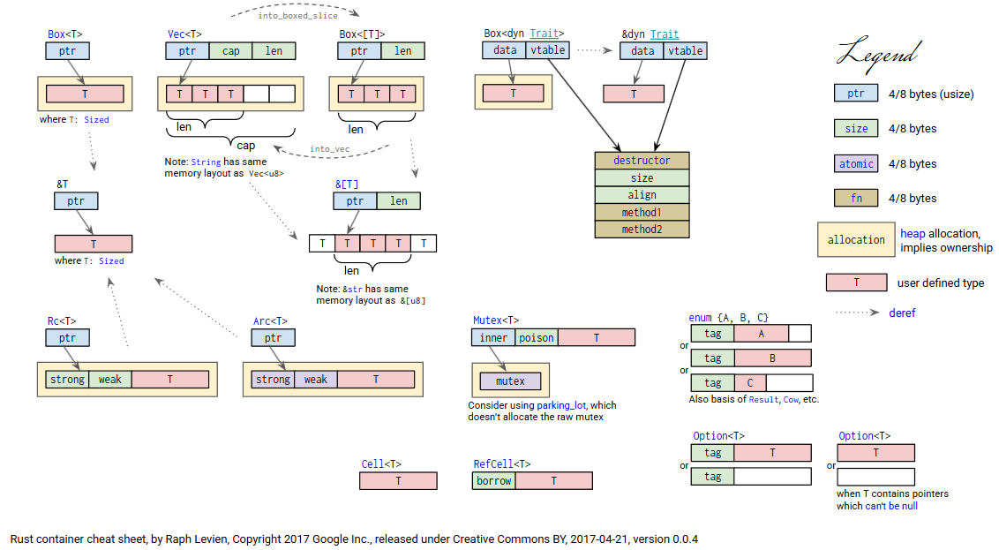
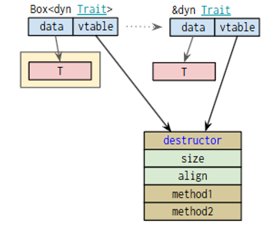
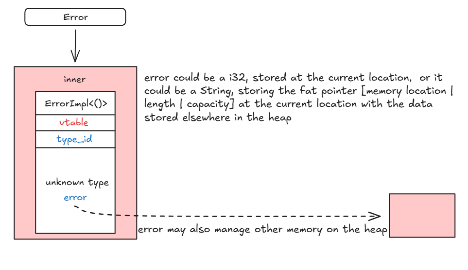
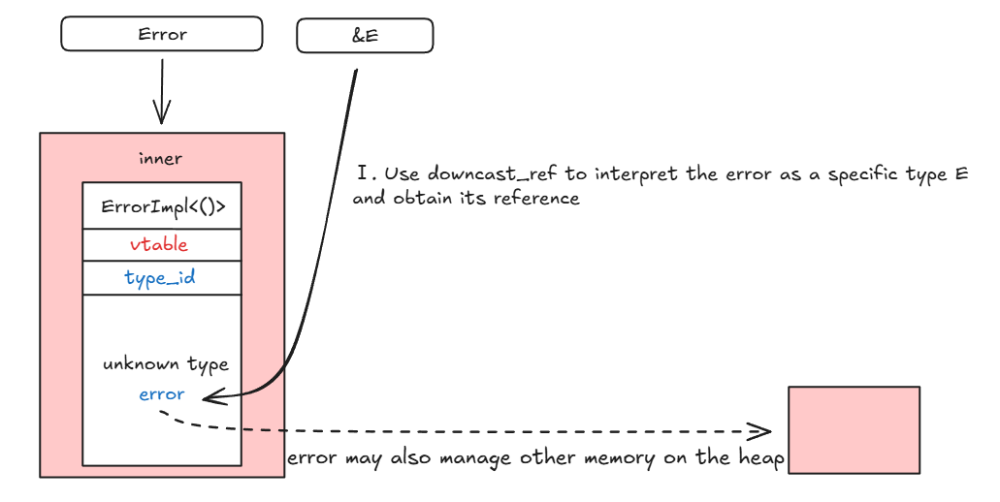
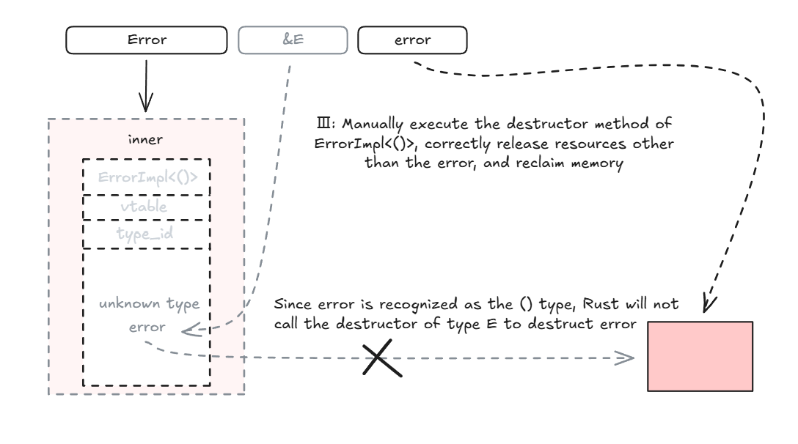

# 利用类型擦除和来实现高性能的任意类型的错误处理

即使rust使用了合并错误流Result的概念使得对错误流的处理大大简化，但处理所使用的不同错误类型仍是一个恼人的工作，试想一下，在你的应用中某个函数调用了不同的外部库方法，而不同的外部库方法使用了不同的错误(库作者自己封装的)类型，而你要做的是针对每一种不同的外部库方法编写专门的模式匹配逻辑消费(处理)这些错误。

## 使用类型擦除统一错误类型

使用**类型擦除技术**是一个不错的选择。类型擦除允许你对某个类型进行信息删减，只保留它的某个状态（功能），比如CPP中的虚基类，Rust中的动态类型，都体现了类型擦除的思想。

使用 `Result<(), dyn std::error::Error>` 返回值类型来表示：我想返回一个 `Result`，并且我的 `Err` 类型为 `dyn std::error::Error` 。现在只要是实现了 `std::error::Error` 的特征，我们的函数都可以正确接受并使用 `?` 快速向上传播：

```Rust
fn render() -> Result<String, Box<dyn std::error::Error>> {
    let file = std::env::var("MARKDOWN")?;
    // 等价于
    // let file = match std::env::var("MARKDOWN") {
    //     Ok(v) => v,
    //     Err(msg) => {return Err(Box::new(msg) as Box<dyn Error>)}
    // };
    let source = read_to_string(file)?;
    Ok(source)
}
```

`Err(Box::new(msg) as Box<dyn Error>)` 是在编译期完成的转换，无运行时开销

### 编译期成本与运行时开销
你可能会对`无运行时开销`感到疑惑，这里分别对编译期和运行时做一个明确的描述:

#### 编译期

先来看看rust中动态对象的布局方式：


当编译期将具体类型转化为动态的特征类型时，编译器会查看代码中所有需要转化的具体类型，为每一个具体类型生成一个针对该特征类型的虚表。这个虚表是**静态**的，被硬编码至二进制文件当中的，在程序启动时被加载到内存中，并且在程序的整个生命周期内都存在，其内保存了该具体类型->目标动态类型的信息，包括其析构函数指针、大小、对齐方式、特征方法函数指针。之后在链接期确定地址。总结为一句话，类型转换是一次性成本，一次编译，永久交付，不会在运行时再产生额外开销。

#### 运行时

在运行时, `dyn trait` 会在内存空间中分配内存存储 `T` 的数据，这是具体类型 `T` 的固有开销。

当调用trait方法时:
1. 通过 `dyn trait` 胖指针查找虚表在程序运行时的内存位置（一次寻址）；
2. 通过虚表内偏移量找到调用目标方法的函数指针；
3. 参数传入对应寄存器，跳转到函数指针目标内存位置执行函数(两次寻址)；

相对的，使用静态分发（泛型或者具体类型的方法）调用方法时：
1. `call Type::Function_f()`

可以看到，特征对象的函数调用（动态分发）要比具体类型的函数调用（静态分发）多了两次寻址操作，这是它的运行时开销来源。

> 虚表的缓存亲和性
> - 虚表本身是连续的，所以连续访问同一具体对象的特征对象虚表是缓存友好的
> - 每次调用需要从虚表跳转到函数代码，这两者地址可能不连续，会导致指令缓存压力
> - 对于 `Vec<Box<dyn Trait>>`， 由于不同的具体对象的特征对象虚表位置高度分散，所以它是缓存不友好的 :(

### 总结

使用类型擦除可以极大简化对具体类型的处理，将拥有共同特征的类型退化为特征对象后，非常方便我们编写代码逻辑，但代价是在运行时存在一定的性能开销，虽然它在现代cpu的性能下显得微乎其微，但在性能敏感的场景下还是需要谨慎使用的。

> 性能敏感场景举例
> 比如编写一个图形渲染库，要动态的选择不同的后端（Vulkan，GL，Direct3D），由于图形渲染高度性能敏感，每秒可能涉及上百次的调用，此时使用动态分发会有性能损失（但话又说回来，这些开销对比GPU的任务来说不算什么，性能瓶颈一般是在 GPU side）

## 任意错误类型转换到自定义类型

诚然我们可以使用 `Result<(), dyn std::error::Error>` 来统一错误类型，但是一旦将具体错误类型转换为特征对象，原始的类型信息就被擦除了。这使得在运行时很难对特定错误类型进行精确匹配和处理，只能通过向下转换（downcasting）来**尝试**恢复原始类型。 并且由于类型信息丢失，调试时可能难以确定错误的准确来源和类型，特别是当错误经过多层传播后。

相对的使用我们自己的自定义类型，我们可以做到保留原始类型信息，方便向下转换；并且可以记录错误链，查看错误的传播路径，获得更好的调试体验。

或许通过精心的内存布局控制和手动实现虚表，获得一些性能上的提升（也可能不会提升，作者也搞不太清楚，希望有大拿解惑）

### 实现

我们先来说说如何实现自定义虚表

以处理错误类型作为示例，我们想统一处理不同的错误类型，一个有效的方法是将他们统一擦除为 `std::error::Error` 特征对象:

```rust
fn funciton() -> Result<(), Box<dyn std::error::Error>>{
    ...
}
```

现在我们手动对 `dyn Error` 特征对象做出实现:

```rust
// lib.rs
#[repr(C)]
struct ErrorImpl<E> {
    vtable: *const (), // ()类型的指针，代表不可执行偏移计算的指针形式，语义更加明确，他就是一个地址
    type_id: TypeId,   // 存储错误类型的 TypeId，用于转换。
    error: E,          // 实际的错误数据
}
```
使用`C`类型的布局表示字段顺序不会因为编译器优化而改变，`vtable` 指向一个内存位置，`type_id` 用来记录擦除前错误的具体类型，`error` 则用来记录 `E` 类型的错误信息（`Err(E)`）

非常好，我们的“万能错误类型”已经有了元数据结构，现在正是问题的关键，我该用什么样的类型去承载元数据结构呢?

让我们明确一下我们的需求，不论其它错误是什么类型，不论其携带的错误信息是什么类型，我们都应能够使用我们的“万能错误类型”承载它们，所以: 该结构内存大小应当稳定不变， 换句话说，我们的万能错误类型不应该因为泛型 `E` 的改变而改变:

```rust
// lib.rs
#[repr(C)]
struct Error {
    inner: ErrorImpl<()>
}
```

同样使用 `C` 布局让结构保持稳定。 `Error` 结构体不能因为 `E` 类型的改变而改变，换句话说我们应将泛型类型确定。那应该将 `ErrorImpl` 的泛型参数规定为什么呢？ 我们最终的目的是让 `Error` **错误类型** 无关的，所以正如我们使用无类型指针 `*const ()` 一样， 我们使用 `()` 来确定泛型类型。

问题接踵而至！如果使用 `()` 无大小类型来规定泛型类型，那岂不是 `ErrorImpl` 无法承载任何的错误信息了🤯? 

是的，我们想让 `Error` 类型固定（同样也是大小固定）， 所以使用了 `()` 来规定泛型，但这直接封杀了 `ErrorImpl` 存储多样错误类型的可能。改进的方法是，**使用`Box`包裹 `ErrorImpl`**。

```rust
// lib.rs
#[repr(C)]
struct Error {
    inner: Box<ErrorImpl<()>>
}
```

`Box` 作为ZST（零成本抽象）类型，它只存储指针而不存储其它元数据。所以这里面大有文章可为！我们可以先以 `E` 类型实例化一个 `ErrorImpl<E>` 对象，再将 `Box<ErrorImpl<E>>` 重新解释为 `Box<ErrorImpl<()>>` 以此创建 `Error` 实例。

让我们分析一下可行性:

- `Box` 分配内存后，只记录指针地址，内存如何解释取决于其内的指针类型 `T`；
  
- 创建 `Box<ErrorImpl<E>>` 实例时，在堆上分配的内存一定大于 `Box<ErrorImpl<()>>` 实例所占内存，因为 `E` 类型大小一定大于等于 `()` 这个零大小类型，所以 `ErrorImpl<E>` 的内存容量必然可以容纳 `ErrorImpl<()>`，因此配合 `C` 布局（字段顺序固定）重新解释指针类型不会引发未定义行为。
  
- 运行时触发 `Box` 析构函数回收内存时，回收内存的大小由*全局内存分配器*决定而不由编译期 `Box` 体内的指针类型决定，可以安全回收 `Box<ErrorImpl<()>>` 分配的内存，大小为转换前的 `Box<ErrorImpl<E>>` 所分配的内存大小。

- 在资源回收时需要慎重，原本正确的流程应该是：`Error` 创建时，内存分配器为`inner: Box<ErrorImpl<E>>` 分配内存；`Error` 生命周期结束时，调用其成员`inner: Box<ErrorImpl<E>>`的析构，继而准备析构 `ErrorImpl<E>` 结构，`ErrorImpl<E>` 析构前会先调用其内部成员的析构，此时会执行 `E` 的`drop` 析构方法（如果有的话），然后 `ErrorImpl<E>` 正确析构，然后 `Box<ErrorImpl<E>>` 内存被释放。但是由于我们将 `ErrorImpl<E>` 解释为了 `ErrorImpl<()>`，编译器就不会调用原本应该被调用的 `E` 的析构函数，这可能导致内存安全问题！所以在 `Error` 析构时我们应该手动完成对资源 `E` 的释放。

- `E` 的生命周期应该是 `'static` 的，即 `E` 拥有所有的数据成员而没有非静态引用，并且允许它一直存活到程序结束。
  
接下来专注于 `ErrorImpl<E>` 的内部， `ErrorImpl<E>` 最终会被转化为 `ErrorImpl<()>` ，`E` 的缺失让我们必须在转换前记录其`Type_Id`以便于反向转换；必须在转换前取得 `E` 对应的特征对象虚表结构以便调用其方法；必须在转换前正确为`ErrorImpl<E>` 的 `error` 字段赋值； 

首先获取虚表，先观察动态对象指针的内存布局：


它的布局方式是
```rust
// lib.rs
#[repr(C)]
struct TraitObject{
    data: *const (),    // usize 大小的指针类型指向数据data
    vtable: *const (),  // usize 大小的指针类型指向虚表
}
```
构建 `ErrorImpl` 和 `Error` :
```rust
//lib.rs
use std::error::Error as StdError
impl Error {
    /// 我们要求`E`是`'static`的，即
    /// - `E` 不可以包含不属于自己的数据或者说是非静态引用
    /// - `E` 可以（但不必要）一直存活
    /// 转移error所有权
    fn new<E>(error: E) -> Self
    where
        E: StdError + Send + Sync + 'static,
    {
        Error::construct(error, TypeId::of::<E>())
    }

    fn construct<E>(error: E, type_id: TypeId) -> Self
    where
        E: StdError + Send + Sync + 'static,
    {
        unsafe {
            // 1. 首先将 &error 解释为 &dyn StdError，这会在编译期生成虚表，
            // 2. 再将&dyn StdError指针解释为我们的TraitObject
            let obj = mem::transmute::<&dyn std::error::Error, TraitObject>(&error /*完成1. 的自动类型转换*/);
            // Box分配内存
            let inner = Box::new(ErrorImpl {
                vtable: obj.vtable, // 取得虚表指针
                type_id: type_id,   // 取得type_id
                error: error,       // 取得源数据
            });
            // 关键所在，将 Box<ErrorImpl<E>> 解释为 Box<ErrorImpl<()>>
            Error {
                inner: mem::transmute::<Box<ErrorImpl<E>>, Box<ErrorImpl<()>>>(inner),
            }
        }
    }
}
```

#### 实现 `?` 传播

目前我们实现了从其他错误类型构造我们错误类型（并将错误的所有权转移）的功能，但现在还不能方便的从其它错误类型转换为我们的类型。所以需要实现 `From` Trait：

```rust
// lib.rs
pub type Result<T> = std::result::Result<T, Error> //封装类型

impl<E> From<E> for Error 
where E: StdError + Send + Sync + 'static, {
    fn from(value: E) -> Self {
        Error::new(value)
    }
}
```

测试一下：

```rust
//main.rs
fn main() -> std::result::Result<(), ()> {
    let _ = our_fn();
    Ok(())
}

fn our_fn() -> Result<()> {
    let _ = lib_fn()?; // 关键部分，其他错误类型可以轻易转换到我们的错误类型
    Ok(())
}

fn lib_fn() -> std::result::Result<i32, std::io::Error> {
    let err = std::io::Error::new(std::io::ErrorKind::AlreadyExists, "文件已经存在");
    Err(err) // 模拟返回错误的情况
}
```
#### 资源回收

在其他错误类型转换为我们的 `Error` 类型时会发生所有权转移，错误数据 `error` 已经转移到 `Error` 的体内, 并且类型擦除后编译器无法获知其类型，无法正确调用其析构函数，所以我们要负责回收它的资源，剩下的资源回收工作交给 `Box` 的内存分配器。

所以该怎么回收已经被擦除了类型的数据呢? 答案就藏在虚表中。我们的虚表是 `E` 类型经由转化为动态分发而得到的，其内包含了 `E` 类型的所有基本信息。

```rust
// lib.rs
impl Error{
    ...

    fn drop_error_data(&mut self) {
        // 按照约定，析构函数位于虚表的开头（其实是危险操作，你可不能保证什么时候约定就改变了）
        let destructor = unsafe { *(self.inner.vtable as *const fn(*mut ())) };
        destructor(&mut self.inner.error);
        println!("成功调用析构函数")
    }
}

impl Drop for Error {
    fn drop(&mut self) {
        self.drop_error_data();
    }
}
```

我们在调用析构函数时传入的类型是 `()` 类型，这能够正确调用它吗？ 我们可以观察一下程序运行时的调用堆栈：


你可以观察到析构函数正调用了我们示例中编写的错误类型 `std::io::error::Error` 的析构函数`drop_in_place<std::io::error::Error>`，这是因为当初将 `std::io::error::Error` 转化为动态对象时，编译器为其生成的虚表中的析构函数指针已经指向了它正确的析构函数，并且该函数它相信我们传入的数据的指针是 `std::io::error::Error` 类型的数据指针，所以该函数会被正确执行。

呃，虽说我们的资源释放做的不错, 但是涉及到了太底层的操作，比如我们按照约定调用了位于虚表开头的析构函数，这比unsafe还要unsafe，有没有抽象程度更高的方法呢？

有的，我们可以使用 `ptr::drop_in_place` 函数：

```rust
//lib.rs
impl ErrorImpl<()> {
    /// 该方法将我们解包的代表 &dyn 指针的结构体对象重新解释为 &mut dyn 指针 
    fn error_mut(&mut self) -> &mut (dyn StdError + Send + Sync + 'static){
        let object = TraitObject {
            data: &mut self.error,
            vtable: self.vtable,
        };

        unsafe {
            mem::transmute::<TraitObject, &mut (dyn StdError + Send + Sync + 'static)>(object)
        }
    }
}

impl Drop for Error {
    fn drop(&mut self) {
        // 调用 ptr::drop_in_place 释放内存
        unsafe { ptr::drop_in_place(self.inner.error_mut()) }
    }
}

```

`ptr::drop_in_place` 通过泛型调用指定的参数类型的析构方法，在这里是调用了 `dyn` 对象的析构方法，rust编译器会帮我们自动编写汇编代码找到虚表中的析构函数进行调用，就不必我们自己查找了。

#### 向下转化为具体类型

在某些情况下，我们期望将抽象类型向下转换为具体类型，比如在我们的例子中，我们想将 `Error` 转换为具体的 `std::io::Error`。这里有需要考虑的几个问题:

1. 转换到某一具体类型可能会失败，原因是目标具体类型和 `Error` 的源类型 `type_id` 不同；
2. 转换成功，但是只获取转换后的引用（或者说只是将对 `Error` 的引用转换成对具体类型的引用）；
3. 转换成功，并获取数据的所有权，释放 `Error`；

#### 判断类型合法性 

第一个问题十分简单，因为我们在 `Error` 的创立之初就保存了它的原类型id，我们用一个简单的内置方法实现判断：

```rust
// lib.rs
impl Error{
    ...
    pub fn is<E>(&self) -> bool
    where
        E: Display + Debug + Send + Sync + 'static, 
        //TypeId 希望 E 类型是 'static 的, 保证在整个程序生命周期其类型id唯一
    {
        if TypeId::of::<E>() != self.inner.type_id {
            return false;
        } else {
            return true;
        }
    }
}
```

#### 转换为具体类型的引用 

对于第二个问题，我们的实现思路是：

一旦目标类型通过了 `type_id` 审查，那么可以确信 `ErrorImpl<()>` 中的 `error` 无类型字段可被安全转换，还记得 `error_mut` 函数吗？ 它的功能是从 `Error` 中取出 `data` 和 `vtable` 指针，并将它们合并重塑为 `&mut dyn` 对象指针。我们可以使用其对应的不可变版本来获取动态对象指针，并将指针进行类型转换(切片)，只取数据指针部分，剔除虚表指针部分：

```rust
// lib.rs
impl ErrorImpl<()> {
    fn error(&self) -> &(dyn StdError + Send + Sync + 'static) {
        let object = TraitObject {
            data: &self.error,
            vtable: self.vtable,
        };
        // 取出数据和虚表指针，合并并重解释为动态对象
        unsafe { mem::transmute::<TraitObject, &(dyn StdError + Send + Sync + 'static)>(object) }
    }
    ...
}

impl Error{
    ...
    pub fn downcast_ref<E>(&self) -> Option<&E>
    where
        E: Display + Debug + Send + Sync + 'static,
    {
        if self.is::<E>() {
            // 将[data|vtable]指针切片为[data], 解引用指针取得数据再取引用完成类型转换
            unsafe { Some(&*(self.inner.error() as *const dyn StdError as *const E)) }
        } else {
            None
        }
    }
}
```

测试时间!

```rust
// main.rs

fn lib_fn() -> std::result::Result<i32, std::io::Error> {
    let err = std::io::Error::new(std::io::ErrorKind::AlreadyExists, "文件已经存在");
    Err(err) // 模拟返回错误的情况
}

fn always_err_fn() -> Result<()> {
    let _ = lib_fn()?; // 关键部分，其他错误类型可以轻易转换到我们的错误类型
    Ok(())
}

fn main() -> std::result::Result<(), ()> {
    let res: Error = always_err_fn().unwrap_err();
    let msg: &std::io::Error = res.downcast_ref().unwrap();
    
    println!("{:?}", msg);
    Ok(())
}
//  output: Custom { kind: AlreadyExists, error: "文件已经存在" }
```

#### 转换为具体类型转移所有权

第三个问题。首先我们的需求是，将 `ErrorImpl<()>` 中的 `error:()` 重新解释为 `E` 类型并且获取其所有权，但这里有一个致命的问题，就是 `Error` 结构体已经实现了` Drop trait`，rust编译器认为：`Error` 析构时执行的Drop函数会索要其内部成员的所有权，在这之前所有移动其内部成员的操作都可能会导致Drop时发生未定义行为，（可以运行rustc --explain E0509查看细节）。那先使用 `mem::forget(Error)` 让其析构函数不再被执行，再处理其内的数据可不可以呢？肯定不可以，因为 `mem::forget` 会索要 `Error` 的所有权，之后不能再移动其内的成员了。
未成年回避，接下来是unsafe的时候了，有请 `ptr::read` !

> `ptr::read(*const T)` 允许通过一个指向对象的裸指针来“复制”一个对象的所有权。这违反了rust世界的所有权模型-即对象只能被一个变量所拥有。使用 `ptr::read(*const T)` 时，rust会复制指向T的变量为一个新的变量，前后两个变量共同拥有资源T，而逻辑上原本的变量应该指向一个未初始化内存（实际并非如此）
> 这是十分unsafe的，`ptr::read` 之后，编译器并不知道原变量内部的堆内存已经被“偷走”，它仍然认为s是有效的，这意味着前后两个变量在生命周期结束后都会执行析构函数释放资源，导致双重释放的问题。

用图片描述一下内存模型:



首先用 `downcast_ref()` 向下转换 `error` 为 `E` 类型并获取引用：



然后用 `ptr::read` 通过 `error:E` 的**引用**“复制”一份 `error` 到栈上，此时双重所有权问题出现：


`Error`是能够正确释放所有资源的，还记得吗？ 在Error::Drop中我们先将`Box<ErrorImpl<()>>`类型转换为了`Box<ErrorImpl<E>>`之后再执行的析构，编译器是能够正确找到error的析构函数的。所以为了避免双重所有权导致的双重析构问题（`error` 所持有的数据会被释放两次），我们应该告知编译器不要自动析构 `Error` 以避免自动触发 `error` 的资源释放，但是如果不自动执行析构，`vtable` 指针和`type_id` 就不会被析构，并且inner的内存就不会被内存分配器回收，从而导致了内存泄漏问题，所以我们应该想出一个两全其美的方法，既能让内存分配器回收内存，又能避免触发 `error` 的析构函数。

思路清晰，我们应该手动执行进行类型转换（从`()`转换到`E`）前的析构逻辑，即 `Box<ErrorImpl<()>>` 的析构逻辑，正确析构 `vtable` 和 `type_id`，并且由于 `error` 的类型是 `()` 而不会执行 `E` 的析构函数，最后由内存分配器正确回收内存👍。



由于 `Error` 实现了 `Drop Trait`，所以我们不能使用 `drop(Error.inner)` 移动其成员的所有权，所以这里还是要借助`ptr::read`来释放资源。

最后，为了避免Error的双重释放（因为其 `inner` 提前被我们手动释放了），应该使用 `mem::forget(Error)`告知rust不要再自动释放` Error` 的内存了。

思路已成，开始码：

```rust
// lib.rs
impl Error{
    ...
    pub fn downcast<E>(self) -> std::result::Result<E, Self>
    where
        E: Display + Debug + Send + Sync + 'static,
    {
        if let Some(error) = self.downcast_ref::<E>() {
            unsafe {
                let error: E = ptr::read(error as *const E);
                drop(ptr::read(&self.inner));
                mem::forget(self);
                Ok(error)
            }
        } else {
            Err(self)
        }
    }
}
```

测试，程序能够正常退出，未出现 `STATUS_HEAP_CORRUPTION` 对破坏错误 :)

> 读者也可以尝试 `Box::into_raw` 和 `from_raw` 的组合来实现

有一个额外的好处是，使用 `ptr::read` 会将数据读取到栈上，如果 `error` 本身是 `i32` 等值类型，`ptr::read` 会将其从堆上转移到栈上提升性能。

至此，我们利用类型擦除统一了错误类型，实现了使用 `?` 操作符快速转换，还提供了api方便向下转型，保证了内存安全。有懂行的同学已经看出来这正是大名鼎鼎的 `anyhow` 库的核心实现原理，真是无处不体现作者的小巧思